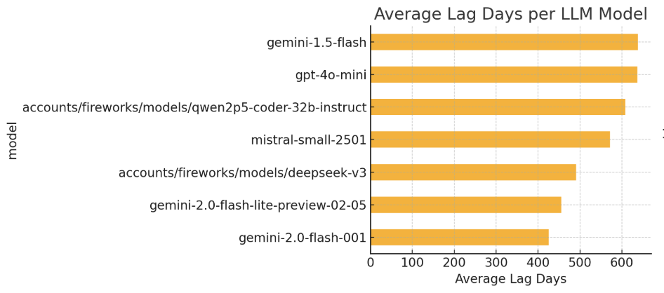
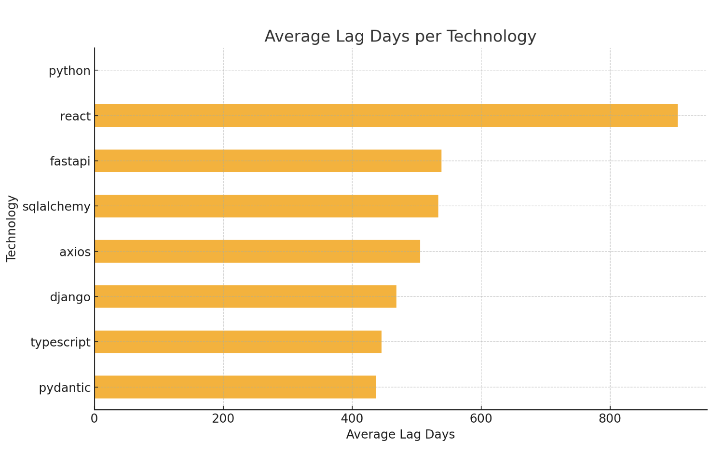

# LLM LIB LAG (3L)




Other vizualizations at [gpt](https://chatgpt.com/c/67a4ca60-f83c-8008-9ff0-e2960b09d8c1)

This project aims to investigate and quantify the "knowledge gap" that exists in Large Language Models (LLMs) regarding the latest versions of programming languages, frameworks, and libraries. Because LLMs are trained on data up to a certain cutoff point, they are inherently unaware of updates released after that date. This project seeks to:


Identify the Lag: Determine how far behind various LLMs are in their knowledge of specific software versions.

Evaluate Prompting Strategies: Experiment with different prompting techniques to see if it's possible to elicit more accurate version information from LLMs, even if they don't have explicit knowledge of the absolute latest release. This might involve prompts that encourage the LLM to reason about versioning schemes or to state the most recent version it knows.

Automate the Evaluation: Create a system that can automatically test multiple LLMs against a set of known "ground truth" version data.

Visualize the Results: Develop a web UI to display the findings in a clear and accessible way, potentially making the results publicly available.

Potentially Generate Benchmark Data: Explore the possibility of automatically generating benchmark data that captures the differences between software versions, which could be used for further LLM evaluation or training.

# Technology Stack
- Python 3.12
- Package Manager: UV
- LLM interactions : Langchain

## Evaluation logic
**Metrics:**

- Exact Match: Percentage of responses where the LLM provides the exact correct version.

- Major Version Match: Percentage of responses where the major version is correct.

- Minor Version Match: Percentage of responses where the major and minor versions are correct.

- Version Difference: Calculate the difference (in days, weeks, or months) between the LLM's reported version and the ground truth version (if release dates are available).

- Knowledge Cutoff Accuracy: If the LLM states its knowledge cutoff date, verify if that date is accurate.


# Usage

1.  **Run Evaluations:**

    ```bash
    uv run main.py
    ```

    This script will:
    *   Fetch the latest version information for the technologies defined in `src/ground_truths.py`.
    *   Query the configured LLMs (defined in `main.py`) for their knowledge of the latest versions.
    *   Store the results (including execution time and parsed version) in `runs.jsonl`.
    *   Print a summary of the evaluation results to the console, including exact/major/minor match rates and lag statistics.

## Languages, Frameworks and Libraries
### Python
- Major/Minor releases (3.9, 3.10, 3.11, 3.12, 3.13).
- FastAPI
- SQLAlchemy 

### JavaScript
- Latest ECMAScript versions (ES2022, ES2023, etc.)
- Node.js LTS and Current releases.
- Typescript ? 

- Frameworks 
    - React
    - Vue
    - Angular, AngularJS
    - Svelte
    - Next.js
    - Nuxt.js
    - Express

### Java
- Java SE releases (Java 17, Java 21, etc. - the LTS versions) and potentially newer, non-LTS releases.

- Frameworks
    - Spring Boot

### C#
- .NET releases (.NET 6, .NET 7, .NET 8).

### Go
- Go releases (1.20, 1.21, etc.).

### C#
- .NET releases (.NET 6, .NET 7, .NET 8).

### Rust
- Rust releases (1.70, 1.71, etc.).


# Setup

1. Install UV
2. Install pre-commit hooks

```
pre-commit install
```


# Future Work
-   Automate the updating of ground truth data (scraping, API calls).
-   Experiment with different prompting strategies.
-   Add more LLMs to the evaluation.
-   Add more technologies to the evaluation.
-   Add more metrics to the evaluation.
-   Add more evaluation strategies.

### Benchmark Data Generation (Advanced):

Identify Changes: If you can scrape release notes or changelogs, you can potentially identify the specific changes (new features, bug fixes, API changes) introduced between versions.

Generate Questions: Use an LLM to generate questions or tasks that test the LLM's knowledge of these changes. For example:

"What is the new xyz function introduced in version X.Y.Z of [software_name]?"

"How do you handle [specific scenario] in version X.Y.Z of [software_name] compared to version X.Y.W?"


