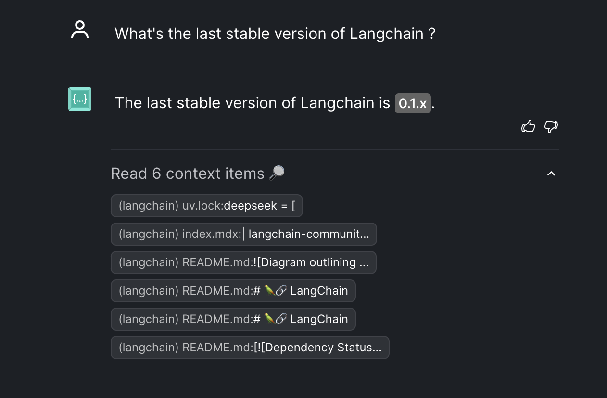
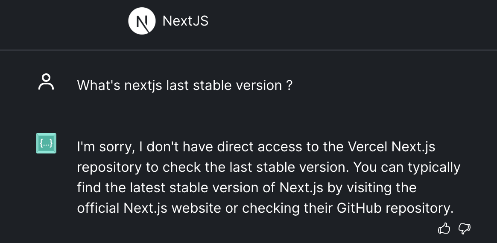

# LLM Library Lag (3L)

[](https://github.com/astral-sh/ruff)

**LLM Library Lag (3L)** quantifies the "knowledge gap" of Large Language Models (LLMs) regarding the latest versions of programming languages, frameworks, and libraries.  LLMs are trained on data up to a cutoff point, making them inherently unaware of updates released afterward.  This project provides a framework for:

*   **Measuring Lag:**  Determining how far behind various LLMs are in their knowledge of specific software versions.
*   **Evaluating Prompting Strategies:** Experimenting with different prompts to elicit accurate version information.
*   **Visualizing Results:**  Presenting findings clearly and concisely (future enhancement: interactive dashboard).

This project is particularly relevant for applications relying on LLMs for code generation, code migration, or software engineering tasks, where up-to-date dependency knowledge is critical.

## Technology Stack

*   **Python 3.12+**  
*   **`uv`:**  Blazing-fast package management.
*   **LangChain:**  Framework for interacting with LLMs.
*   **Pydantic:**  Data validation and settings management.
*   **Requests & BeautifulSoup:**  Fetching and parsing data from web sources.
*   **Pytest:**  Testing framework.
*   **Ruff:**  Extremely fast Python linter and code formatter.
*   **Pre-commit:**  Automated code quality checks before commits.

## Supported LLM Providers

The project supports all LLMs currently supported by LangChain. We test the following:

*   **OpenAI:**  `gpt-4o-mini`, `gpt-4o-2024-08-06`, `o3-mini-2025-01-31`
*   **Google GenAI:** `gemini-1.5-flash`, `gemini-2.0-flash-001`, `gemini-2.0-flash-lite-preview-02-05`
*   **Mistral AI:** `mistral-small-2501`
*   **Anthropic:** `claude-3-5-haiku-20241022`
*   **Fireworks AI:** `qwen2p5-coder-32b-instruct`, `deepseek-v3`
*   **Perplexity:** `sonar`
*   **Groq:**`deepseek-r1-distill-qwen-32b`

*(Easily extendable to support other providers.)*

## Supported Languages and Package Managers

Currently, 3L fetches version information from the following sources:

| Language / Framework          | Package Manager | Source                                      |
| ----------------------------- | --------------- | ------------------------------------------- |
| Python                        | PyPI            | `https://pypi.org/pypi/{library_name}/json` |
| JavaScript / TypeScript        | NPM             | `https://registry.npmjs.org/{library_name}` |
| Java                          | Maven Central   | `https://repo1.maven.org/maven2/...`        |
| Ruby                          |  (Language)    |  `https://www.ruby-lang.org/en/downloads/releases/` (parsed with BeautifulSoup)|
| Rust                          |  (Language)    |  GitHub API (rust-lang/rust)                |
| Python                        |  (Language)         | GitHub API (actions/python-versions)            |


The `ground_truths.py` file contains a curated list of specific libraries and frameworks, including:

* **Python:** FastAPI, Django, SQLAlchemy, Pydantic, LangChain
* **JavaScript:** React, Vue, Angular, TypeScript, Axios
* **Java:** Spring Boot
* **Ruby**
* **Rust**
* **Python**

*(Easily extendable to add more.)*

## Evaluation Logic

The evaluation process involves:

1.  **Fetching Ground Truth:**  Retrieving the *actual* latest stable version and release date for each technology from its official source.
2.  **Querying LLMs:**  Prompting each configured LLM to determine its knowledge of the latest version.
3.  **Parsing Responses:**  Extracting the version string (if any) from the LLM's response using a robust regular expression.
4.  **Calculating Metrics:**  Comparing the LLM's reported version to the ground truth and calculating:
    *   **Exact Match Rate:**  Percentage of responses where the LLM provides the precise correct version.
    *   **Major Version Match Rate:** Percentage of responses where the major version is correct.
    *   **Minor Version Match Rate:** Percentage of responses where the major and minor versions are correct.
    *   **Lag (in days):** The difference between the ground truth release date and the release date of the version reported by the LLM (if available).
    *   **Average/Median/Max Lag:** Provides insights of the lag.
    *   **Execution time**
    *   **Parsed version exists**: Check if the parsed version exists.
5.  **Reporting Results:**  Generating a summary report with overall metrics, per-LLM results, and per-technology results.

## Usage

1.  **Installation:**

    ```bash
    git clone https://github.com/SuperMuel/llm-lib-lag.git
    cd llm-lib-lag
    uv sync
    pre-commit install 
    ```

2.  **Configuration:**

    Create a `.env` file in the project root and set your API keys for the LLM providers you want to use (see `env.example` for the required keys).

    This repo fetches github repositories for Ruby, Rust, and more to fetch the latest version information. To avoid rate-limiting errors, you *must* set `GITHUB_TOKEN` in your `.env` file. See [GitHub Access Token Setup](#github-access-token-setup).


3.  **Run Evaluations:**

    ```bash
    uv run python main.py
    ```

    This will:

    *   Fetch the latest version information.
    *   Query the configured LLMs.
    *   Store the raw results in `runs.jsonl`.
    *   Print a summary report to the console.

4.  **View Results:**

    The raw evaluation runs are stored in `runs.jsonl`. Each line is a JSON object representing a single evaluation run.  You can analyze this file directly or use the provided evaluation logic (`evaluation.py`) to generate reports. You can also create Jupyter Notebooks to explore results.


### GitHub Access Token Setup

We use the GitHub API for certain languages or libraries (e.g. Rust, Ruby, .NET). Without authentication, GitHub imposes strict rate limits, often causing `403` or “rate limit exceeded” errors. To avoid this, you need a **Personal Access Token (PAT).**

1. **Go to GitHub → Settings → Developer Settings → Personal access tokens**  
(or [follow this official guide](https://docs.github.com/en/github/authenticating-to-github/creating-a-personal-access-token)).
2. **Create a New Token** (classic):  
- Choose “Generate new token (classic)”
- Grant the “public_repo” scope (read-only access to public repositories is enough).
- Copy the token.
3. **Set `GITHUB_TOKEN` in your `.env`:**  
```env
GITHUB_TOKEN=ghp_YourTokenHere
```


## Future Work

*   **Automated Ground Truth Updates:**  Implement a mechanism to automatically update the `ground_truths.py` data (or a separate data file) by scraping or using APIs.
*   **More LLMs and Technologies:**  Add support for more LLM providers, languages, frameworks, and libraries.
*   **Asynchronous Execution:** Use `asyncio` and `aiohttp` to improve performance.


### Benchmark Data Generation (Advanced):

Identify Changes: If you can scrape release notes or changelogs, you can potentially identify the specific changes (new features, bug fixes, API changes) introduced between versions.

Generate Questions: Use an LLM to generate questions or tasks that test the LLM's knowledge of these changes. For example:

"What is the new xyz function introduced in version X.Y.Z of [software_name]?"

"How do you handle [specific scenario] in version X.Y.Z of [software_name] compared to version X.Y.W?"

### Interactive Visualization
Goal : Develop a web-based dashboard for exploring the results interactively.

- [ ] Develop and publish a dashboard for exploring the results interactively.
- [ ] Add a leaderboard showcasing the best performing LLMs.
- [ ] Allow users to filter by LLMs, languages, frameworks...
- [ ] Allow users to submit their own LLMs and libraries to the benchmark.

**Tech Stack:**
UI : Probably Streamlit
Backend : Probably FastAPI
DB/DATA : 


# Related Work
 - https://dl.acm.org/doi/abs/10.1145/3674805.3690746


 - A recent pipeline called EVOR (Su et al., 2023) demonstrated the power of RAG for code generation on tasks requiring external knowledge (Retrieval-Augmented Code Generation) (Retrieval-Augmented Code Generation). They constructed a “knowledge soup” combining web search results, documentation, and even execution feedback (like error logs) to help solve coding problems that involved updated libraries or obscure languages. By actively retrieving and updating this knowledge base during generation, EVOR achieved 2–4× higher success on tasks that standard LLMs failed (Retrieval-Augmented Code Generation).

 - **VersiCode** tackles the dynamic nature of software by proposing two novel tasks: ***version-specific code completion*** and ***version-aware code migration***. Its Python dataset tests whether LLMs can adapt code to updated library versions. They introduce a metric called **Critical Diff Check (CDC@1)** to assess if generated code meets new API requirements. Experiments showed that even powerful models like GPT-4 struggle with version changes, often failing to modify code to accommodate updated libraries. This highlights a gap in existing evaluations: code migration is not just about translating between languages, but also about *keeping code correct as dependencies evolve*. VersiCode provides a focused benchmark to measure that, revealing that **version-aware migration remains a significant challenge**.

### HumanEval (OpenAI, 2021)
- HumanEval only evaluates Python code generation for small functions.
- HumanEval do not involve dependencies.

### MBPP (Mostly Basic Programming Problems, Google, 2021)

### SWE-Bench (Princeton, 2023)
- SWE-Bench is focused on Python only.
- Implicit Dependency Handling: SWE-Bench implicitly requires the LLM to understand dependencies (to fix bugs), but it doesn't explicitly evaluate version knowledge.


 ### VersiCode

### [Codeium Live](https://codeium.com/live)


